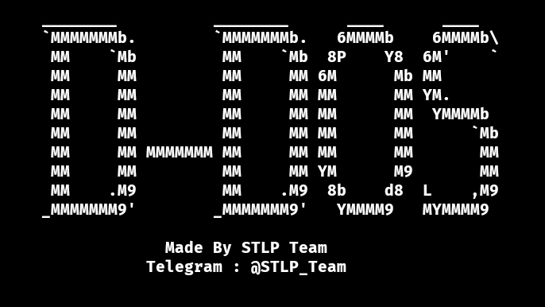
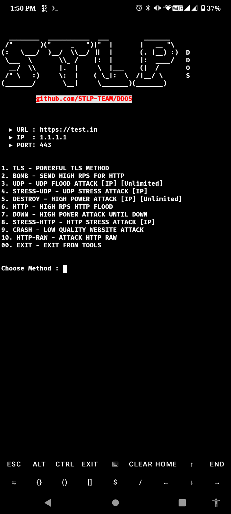

#  💫 DDOS Panel 2024 💥
Best 10 Methods are added in this panel. 100% Free DDos panel by STLP Team


<center></img></center></br>

## Methods:
* 1. TLS - POWERFUL TLS METHOD
* 2. BOMB - SEND HIGH RPS FOR HTTP
* 3. UDP - UDP FLOOD ATTACK
* 4. STRESS-UDP - UDP STRESS ATTACK
* 5. DESTROY - HIGH POWER ATTACK
* 6. HTTP - HIGH RPS HTTP FLOOD
* 7. DOWN - HIGH POWER ATTACK UNTIL DOWN
* 8. STRESS-HTTP - HTTP STRESS ATTACK
* 9. CRASH - LOW QUALITY WEBSITE ATTACK
* 10. HTTP-RAW - ATTACK HTTP HTTP-RAW
<br><br>
<h2>INSTALLATION ⬇️</h2>

* Install Termux latest version from F-Droid. Then run all commands.

* Commands:

```
pkg update -y
pkg upgrade -y
pkg install git -y
pkg install python -y
pkg install golang -y
pkg install perl -y
pkg install nodejs -y
pip install requests socket datetime colorama socks pysocks
cd && rm -rf DDOS
git clone https://github.com/STLP-TEAM/DDOS
cd DDOS
chmod 777 *
python attack.py
```


<h3>SINGLE COMMAND:</h3>

```
pkg update -y;pkg upgrade -y;pkg install git -y;pkg install python -y;pkg install golang -y;pkg install perl -y;pkg install nodejs -y;pip install requests socket datetime colorama socks pysocks;cd && rm -rf DDOS;git clone https://github.com/STLP-TEAM/DDOS;cd DDOS;chmod 777 *;python attack.py
```


<h3>DEMO SS:</h3>
<center></img></center></br>

## Find Us on :

[](https://facebook.com/groups/spamming.termux.learning.point)
[](https://www.facebook.com/Spamming.Termux.Learning.Point)
[](https://t.me/STLP_Team)
[](https://github.com/STLP-TEAM)

<br>
<h3><a href="https://facebook.com/groups/spamming.termux.learning.point/"> ©️STLP-TEAM</a></h3>

<h5><br>Thanks to SAITAMA,leoon123,Zxcr9999 </h5>